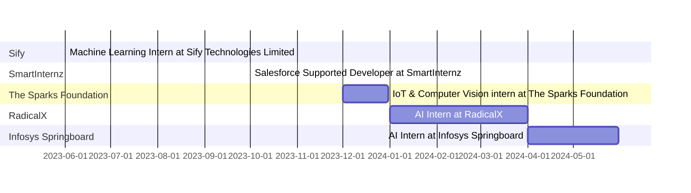

<h1 align="center">Hi   , I'm Ankush Verma</h1>
<h3 align="center">A AI/ML enthusiastic , a sportsman and a singer!</h3>

  

-   I’m currently working on **Generative AI**

-  I’m currently learning **AI/ML**

-   I’m looking for help with **AI/ML**

-  All of my projects are available at [AnkushVe](https://github.com/AnkushVe?tab=repositories)

-  Ask me about   **DSA,OS,DBMS,CN,LLD**

-   Contact me **vermaankush5497@gmail.com**

-   Know about my experiences [https://www.linkedin.com/in/ankushv18/](https://www.linkedin.com/in/ankushv18/)

  ## Work Experience

<h3 align="left">Connect with me:</h3>

<h3 align="left">Languages and Tools:</h3>

                      

&nbsp;

